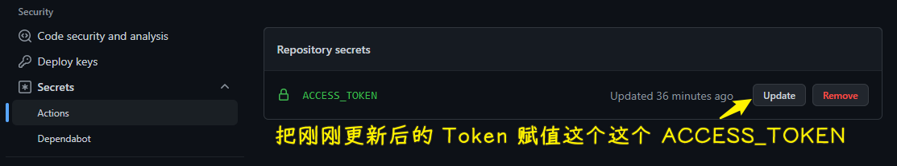

## Cheat Sheet

## 1）Github Actions

ppambler -> Settings -> Developer settings -> Personal access tokens -> ACCESS_TOKEN

ppambler/article -> Settings -> Security -> Actions secrets

## 2）Last Updated 时间有误

准确时间是：更新时间 + 8 个小时

➹：[VuePress Last Updated 时间有误的解决 | Ty's Blog](https://ty-peng.gitee.io/views/note/ops/202004141352-vuepress-last-updated.html)

➹：[actions/checkout: Action for checking out a repo](https://github.com/actions/checkout)

➹：[使用 vuepress 更新我的博客 | Coding and Fixing](https://vxhly.github.io/views/nodejs/vuepress-blog-on-github.html#%E6%8B%93%E5%B1%95%E9%98%85%E8%AF%BB)

## 3）盗链问题

Gitee 做了限制 -> 原因：图片的请求是从哪个域名旗下的网页发起的？同域名就不限制，不同域名就限制 -> 设置`no-referrer`，表示直接在浏览器的地址栏敲下图片地址，也就是不知道来源

在`config`里边配置一下 -> 给`head`添加有关`referrer`的`meta`

➹：[前端解决第三方图片防盗链的办法 - html referrer 访问图片资源403问题 · Issue #31 · biaochenxuying/blog](https://github.com/biaochenxuying/blog/issues/31)

